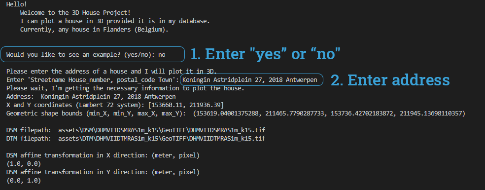
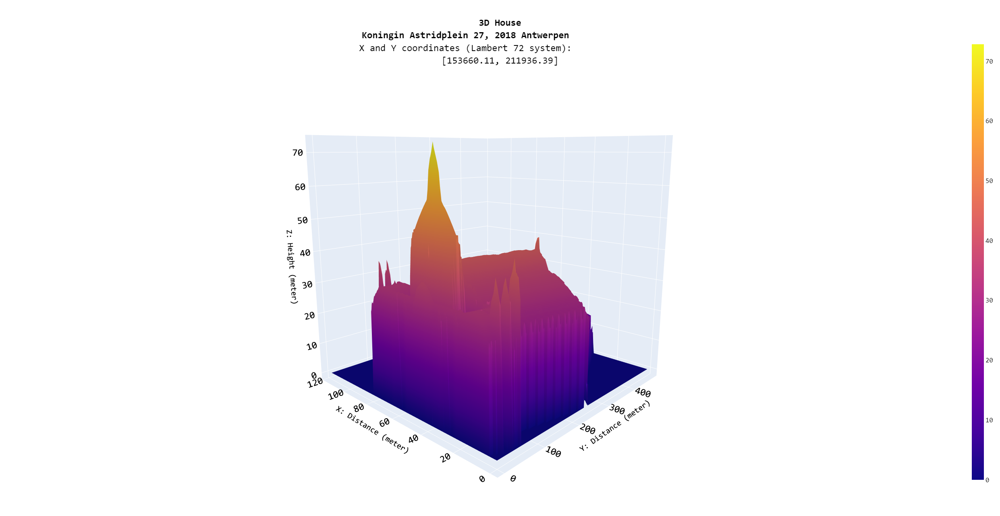

# 3d-house-project
This is a work in progress.


## Table of Contents

- [Introduction](#introduction)

- [Installation](#installation)

- [Instructions](#instructions)

- [Architecture](#architecture)

- [Next steps](#next-steps)

---

## Introduction
### Description
This is a python project for the Geospatial industry company *LIDAR PLANES*. 
The program allows to **model in 3D any house** located in Flanders with only a home address.
The solution development is based on *LIDAR PLANES*'s data: **DSM (Digital Surface Map)** and **DTM (Digital Terrain Map)**.
The data has been collected via the [LIDAR](https://en.wikipedia.org/wiki/Lidar) method.

### Objective
*LIDAR PLANES* wants to create a 3D lookup of houses for its new branch in the insurance business.

### When?
It is a 2 weeks project.
The deadline to complete it is scheduled to `25/02/2021 at 5 p.m.`.

### Visuals
3D plot of the *Palace of Justice Antwerp*:


## Installation
To run the program, you need:
- To download the **DSM** and **DTM** data
- To install the libraries below.

### Download DSM and DTM data
- [DSM](http://www.geopunt.be/download?container=dhm-vlaanderen-ii-dsm-raster-1m&title=Digitaal%20Hoogtemodel%20Vlaanderen%20II,%20DSM,%20raster,%201m)
- [DTM](http://www.geopunt.be/download?container=dhm-vlaanderen-ii-dtm-raster-1m&title=Digitaal%20Hoogtemodel%20Vlaanderen%20II,%20DTM,%20raster,%201m)


### Install the libraries
| Library       | Used to                                        |
| ------------- | :----------------------------------------------|
| Numpy         | To handle Numpy arrays                         |
| Pandas        | To store and access info in a DataFrame        |
| Rasterio      | To read geospatial raster data                 |
| Plotly        | To plot the building in 3D                     |


Follow these instructions to install the required libraries: on terminal
1. Open your terminal
2. cd to the directory where the file *requirements.txt* is located
3. Create and activate your virtual environment.
4. Run: 
```pip3 install -r requirements.txt```

You can even install the libraries and run the program directly after the installation by running the following command line:

4. Run:
```pip3 install -r requirements.txt && python3 run_program.py```

## Instructions
### How to run the program
- Run `run_progam.py` to start the program.
Or
- On your terminal:
```python3 run_progam.py```

### Usage example
#### Example of input the user can give:


#### Output of the example:


## Architecture
The project is structured as follows:

```
3d-house-project
│   README.md               :explains the project
│   run_game.py             :script to run in order to start the program.
│   requirements.txt        :packages to install to run the program
│   LICENSE.txt             :license information
│   .gitignore              :specifies which files to ignore when pushing to the repository
│
└───core                    :directory contains all the core scripts of the program
│   │   __init__.py
│   │   main.py             :execute the program
│   │
│   └───assets              :contains the GeoTiff files
│       ├───DSM
│       └───DTM
```

### Roadmap
- [x] Web scrap *LIDAR PLANES*'s data using Selenium library
- [X] Search and implement new librairies
- [X] Read and use shapefiles
- [X] Read and use geoTIFFs
- [X] Render a 3D plot


### Contributing
Open to contributions.
Requirements to be defined.
Instructions on how to contribute will be described in this section.


### Author(s) and acknowledgment
This project is carried out by **Van Frausum Derrick** from Theano 2.27 promotion at BeCode.
I would like to thank my colleagues and coaches at beCode for their help and guidance.


## Next steps
- Determine requirements for contributions
- Add instructions on how to contribute
- Read GeoTiff files from website without having to download them
- Show 2D and 3D plots next to each other to compare
- Improve the layout of the 3D plot

